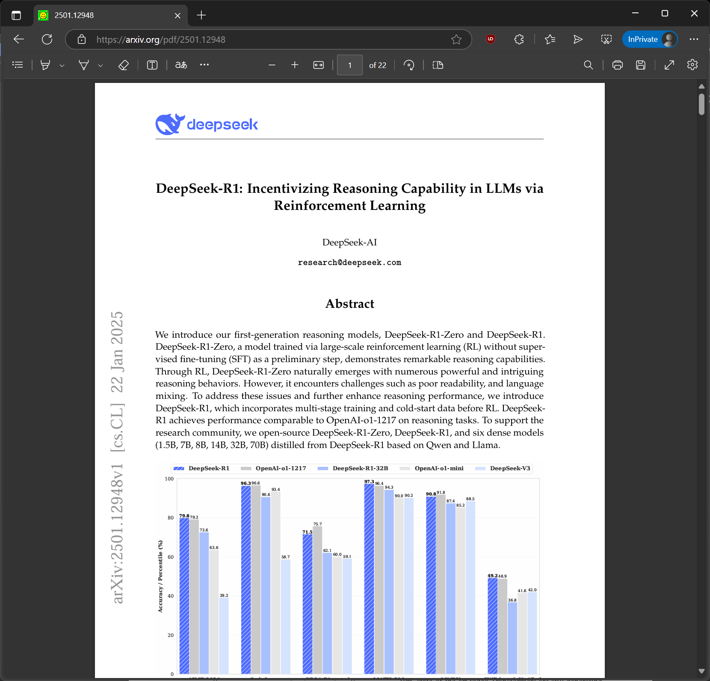
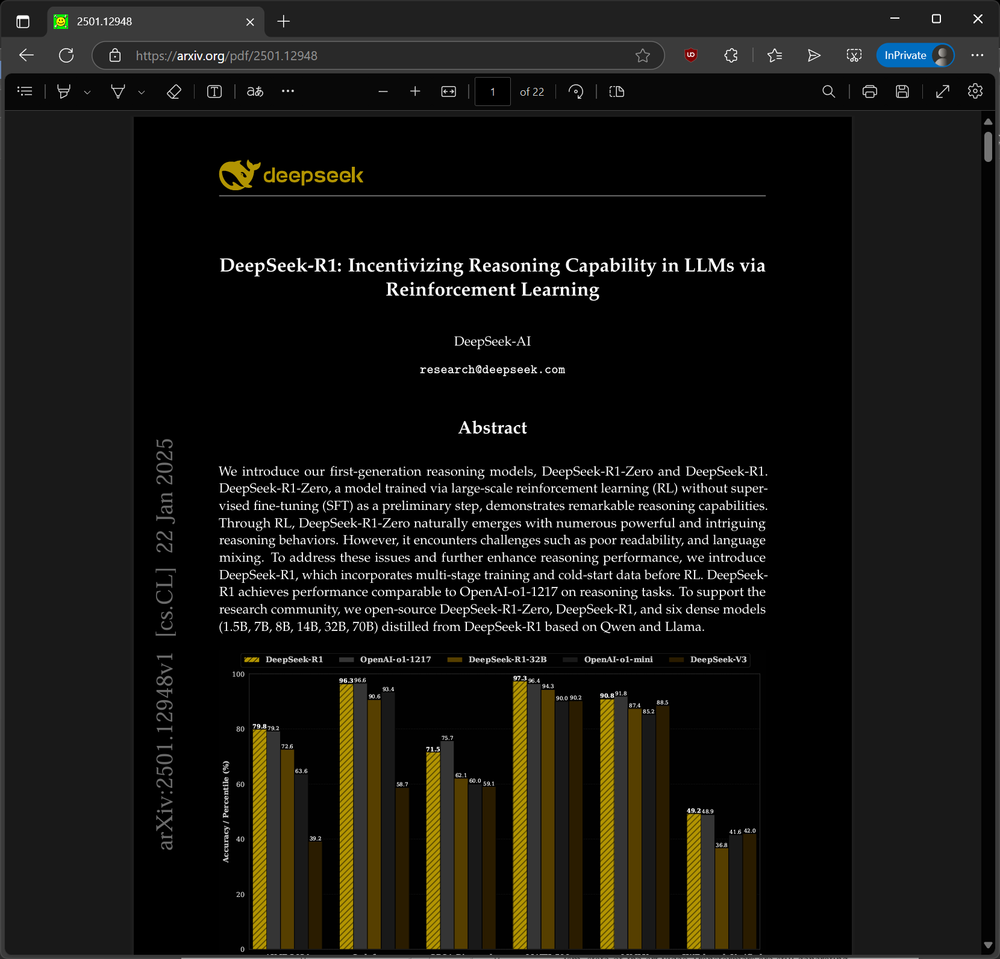

# 🌓 PDF Dark Mode Overlay

A simple JavaScript snippet to give PDF files a dark mode appearance by inverting page colors using a clever CSS blend trick. Great for reducing eye strain while reading bright PDFs, especially at night.

---

## ✨ What It Does

This script:
- Forces light mode to avoid system dark-mode interference
- Adds a fullscreen white overlay with `mix-blend-mode: difference`
- Inverts the colors of the page visually—without altering the actual PDF

---

## 🔍 Before & After

| Before | After (Dark Mode Overlay) |
|--------|----------------------------|
|  |  |

---

## ⚠️ Requirements

Tested only on **Microsoft Edge** (Chromium-based).

To make this work:

1. Go to `edge://flags`
2. Search for **"PDF Viewer Update: OOPIF for PDF Viewer Extension"**
3. Enable it and **restart Edge**
4. Open a PDF in the browser
5. Open **DevTools** (press `F12`)
6. Paste the following code into the **Console**:

```js
const meta = document.createElement("meta");
meta.name = "color-scheme";
meta.content = "light"; // Forces light mode
document.head.appendChild(meta);

let cover = `<div id="inversion" style="
  position: fixed;
  pointer-events: none;
  top: 0;
  left: 0;
  width: 100vw;
  height: 100vh;
  background-color: white; 
  mix-blend-mode: difference;
  z-index: 99;
  "></div>
`
document.documentElement.insertAdjacentHTML('beforeend', cover);
```

---

## 🛠️ Future Plans

If time allows, I might turn this into:
- A **Tampermonkey userscript** that auto-runs on PDF pages
- A **Chrome/Edge browser extension** with a toggle switch

---

## 🧪 Limitations

- Only tested on Microsoft Edge (might work on Chrome with OOPIF as well)
- Requires manual activation for now
- Works best on browser-rendered PDFs, not embedded viewers or download links

---

## 📜 License

MIT – free to use, modify, or improve. Contributions and PRs welcome!
